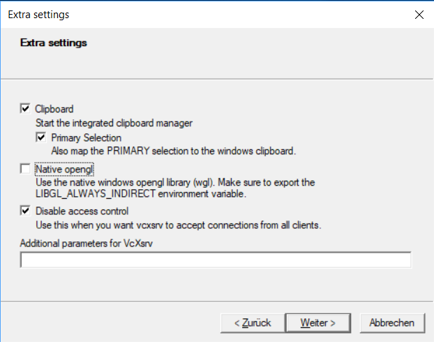

# ROS ML Container
ROS Noetic (ROS2 and Ros-less in the future) container for machine learning with switchable graphics acceleration methods. 

This repository provides a full [Robot Operating System (ROS)](https://www.ros.org/) workspace without actually installing ROS on your machine. The goal of this workspace is to allow for convenient development of somewhat portable ROS applications that run within a container. In order to speed up robot simulation as well as machine learning applications within the container, the graphics card (GPU) of your PC can be passed through to the container. The type of GPU acceleration depends on your graphics card and operating system.

__Apart from using resources from Intel, Nvidia and AMD, this workspace takes inspiration from [this](https://github.com/TW-Robotics/Docker-ROS) great Docker workspace.__

### These GPU acceleration methods are supported:

- __cpu__: No acceleration is applied. This method is good for unsupported OS/GPU combinations or for debugging if GPU acceleration is not working properly.

- __opensource__: Passes through open source drivers of your video card on Linux. This works for Nvidia, AMD and Intel GPUs and passes through OpenGL capabilities. Open source drivers currently do not allow acceleration of machine learning tasks, since they either require __CUDA__ on Nvidia or __OpenCL__ on AMD and Intel. However, using this method will accelerate ROS simulations and visualisations. __If you are on Linux and not sure what GPU acceleration your system supports, it is probably this one.__

- __intel__: Container and Python environment are based on the [Intel AI Toolkit](https://www.intel.com/content/www/us/en/developer/tools/oneapi/ai-analytics-toolkit.html) to allow for accelerated computing using packages supported by Intel. __Requires a compatible 10th gen or higher Intel CPU.__

- __amd__: Bases the Container on the latest [ROCm Container](https://rocmdocs.amd.com/en/latest/ROCm_Virtualization_Containers/ROCm-Virtualization-&-Containers.html). This enables acceleration using OpenGL, OpenCL and through protocols native to ROCm such as tensorflow-rocm.

- __nvidia__: Passes through OpenGL and [CUDA](https://developer.nvidia.com/cuda-downloads) capabilities using the [Nvidia Container Toolkit](https://docs.nvidia.com/datacenter/cloud-native/container-toolkit/install-guide.html).

- __wsl2__: Passes through the [Windows Subsystem for Linux (WSL2)](https://docs.microsoft.com/en-us/windows/wsl/about) virtual GPU to the container in order to allow for OpenGL and DirectML acceleration. __This method is currently required in order to get GPU acceleration working when running Docker from Windows using the WSL2 backend.__ The Nvidia Container Toolkit can work with Docker's WSL2 engine, but this approach is currently not yet validated by Nvidia. See [here](https://docs.nvidia.com/cuda/wsl-user-guide/index.html#installing-insider-preview-builds) for more information.

# Installation

## Prerequisites

You will need to have [Docker](https://www.docker.com/) installed on your system. On Linux, docker can be [installed natively](https://docs.docker.com/engine/install/ubuntu/), while on Windows, it is required to use the [WSL2 backend](https://docs.docker.com/desktop/windows/install/). 

- __Linux__:
  * [Install Docker natively.](https://docs.docker.com/engine/install/ubuntu/)
  * Allow Docker to run without _sudo_ using the `sudo groupadd docker` and `sudo usermod -aG docker $USER` commands. Afterwards, log out and in again to apply changes.

- __Windows__:
  * Windows 10 Update 21h1 or newer is required for the GPU being passed through to WSL2.
  * [Install Docker using the WSL2 backend.](https://docs.docker.com/desktop/windows/install/)
  * __Only required on Windows 10, since Windows 11 has GUI forwarding built-in__:
    - Install [VcXsrv](https://sourceforge.net/projects/vcxsrv/)
    - **(Optional)** [Install WSL GPU preview drivers for Windows](https://docs.microsoft.com/en-us/windows/wsl/tutorials/gui-apps)
    - **(Optional)** If you encounter issues getting the GUI to show up, follow [this guide](https://github.com/microsoft/WSL/issues/4106#issuecomment-876470388) on the *DISPLAY* environment variable in WSL2.
    - **(Optional)** It may be necessary to bypass the Windows firewall for port 6000 in order for the GUI to show up. See [this](https://stackoverflow.com/questions/61860208/wsl-2-run-graphical-linux-desktop-applications-from-windows-10-bash-shell-erro) and [this](https://github.com/cascadium/wsl-windows-toolbar-launcher/blob/master/README.md#troubleshooting) for troubleshooting.

On Linux, some means of acceleration require more packages to be installed on your host system:

- __opensource__: Open source drivers for your video card (On most distributions, open source drivers are installed for AMD and Intel GPUs by default).

- __intel__: Same as opensource.

- __amd__: Either the [amdgpu-pro](https://www.amd.com/en/support/kb/release-notes/rn-amdgpu-unified-linux-21-10) driver, the unofficial [opencl-amd aur package](https://aur.archlinux.org/packages/opencl-amd/) on Arch-based Linux distributions or the [ROCm-OpenCL-Runtime](https://github.com/RadeonOpenCompute/ROCm-OpenCL-Runtime) must be installed in order to access your AMD GPU's OpenCL capabilities on the Linux host.

- __nvidia__: [Proprietary Nvidia GPU driver](https://www.nvidia.com/de-de/drivers/unix/) and [Nvidia Container Toolkit](https://docs.nvidia.com/datacenter/cloud-native/container-toolkit/install-guide.html) installed on your system. Pudget Systems has a good [guide](https://www.pugetsystems.com/labs/hpc/Workstation-Setup-for-Docker-with-the-New-NVIDIA-Container-Toolkit-nvidia-docker2-is-deprecated-1568/) for the installation process. 


## Getting Started Linux

0. Make sure you are meeting the prerequisites
1. Open a terminal and clone this repository `git clone https://github.com/SimonSchwaiger/ros-ml-container`
2. Navigate inside the repository folder and run `bash buildandrun.sh`
3. The script locally builds the docker container and starts it. Once the build is done, you can perform commands such as `roslaunch` from within the container

## Getting Started Windows

0. Make sure you are meeting the prerequisites
1. **(On Windows 10)** Start VcXsrv using the following configuration:


 
2. Clone this repository
3. Open the WSL2 terminal, navigate to the repository folder and run `GRAPHICS_PLATFORM=wsl2 bash buildandrun.sh`

__If you are running the container in Windows under WSL2, you need execute the script from within the Ubuntu shell of WSL. If the script does not execute due to files having the wrong line endings, you can run `find . -type f -print0 | xargs -0 dos2unix` in the ros-ml-container directory to change all the line endings to the unix style.__

# Intended Usage

Upon the first build, an `src` folder and `requirements.txt` are created in the scirpts directory, if they do not already exist. `src` is intended for ROS packages to be placed into. During the build, this folder is copied into the image, dependencies of all packages are installed and the workspace is compiled. The Python3 packages defined in `requirements.txt` are installed using Pip in a virtual environment located at `/myenv` within the image. Since the ROS and Python packages are part of the image, changes in `src` or `requirements.txt` cause a partial rebuild and changes made in the container do not carry over from container to host.

The [`app`](./app) folder is intended to contain configuration files (for example *.rviz*) and scripts. 

Both folders are mounted to the container at runtime. This means that changes made within those two folders from either host or container are shared.

# Advanced Features and GPU Acceleration

The default configuration builds and starts the container in *opensource* mode and forwards port 8888 to the host system. This allows the JupyterLab GUI to be forwarded to the host and accessed [here](127.0.0.1:8888) (the password to access jupyterlab is *ros_ml_container*, but I suggest you change that in your local copy of the [entrypoint.sh](./entrypoint.sh) file). Jupyterlab is automatically installed and started in the set up virtual environment to provide a simple way to open multiple terminals within the Docker container.

### These configurations can be done

* The build and run [script](./buildandrun.sh) is provided to automatically locally build and run the container. The means of GPU acceleration can be passed through using the `GRAPHICS_PLATFORM` environment variable. The first build will take quite a while, but consecutive builds will be faster, since docker caches each stage of the build. However, changing the `GRAPHICS_PLATFORM` will cause a full rebuild of the container.
* Additionally, a Python version other than 3.8 (the Ubuntu 20.04 default) can be specified using the `PYTHONVER` environment variable. 
* Arguments for the run command can be specified using the `DOCKER_RUN_ARGS` environment variable.


Example for running the container with acceleration set to __opensource__, python version 3.7 and forwarding of port 6006 to the host:

```
GRAPHICS_PLATFORM=opensource PYTHONVER=3.7 DOCKER_RUN_ARGS="-p 6006:6006" ./buildandrun.sh
```

# Cleanup

Containers are automatically deleted after shutdown. The generated images must be [removed manually](https://docs.docker.com/engine/reference/commandline/rmi/).

This command deletes all images:

```
docker rmi $(docker images -q)
```